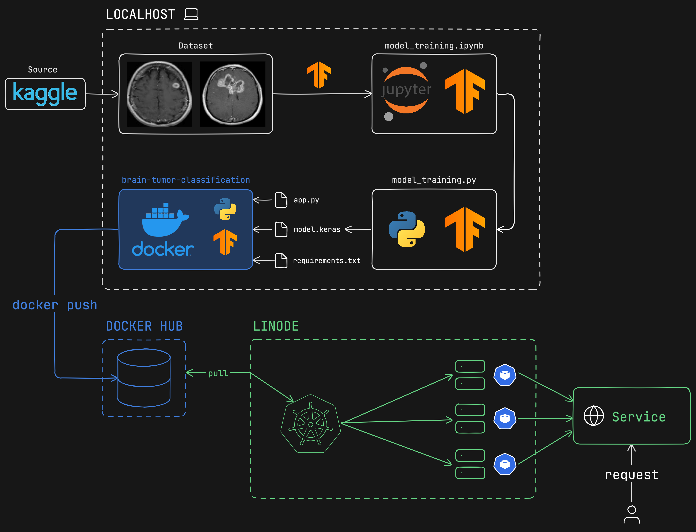
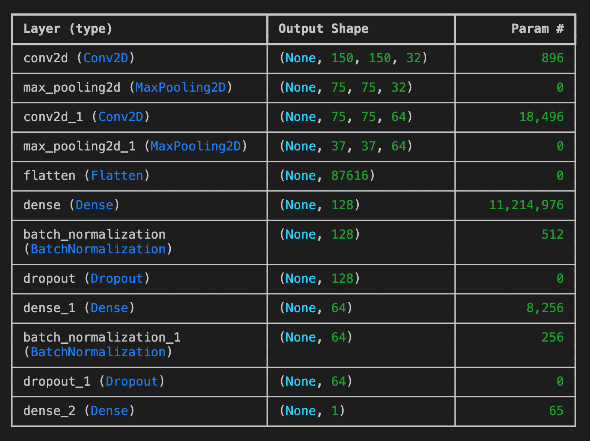
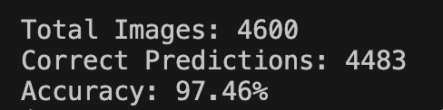
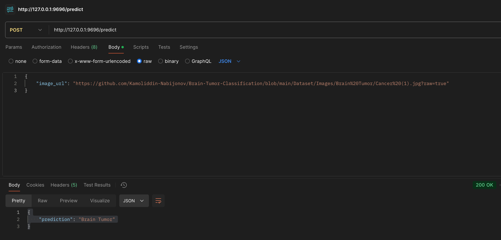
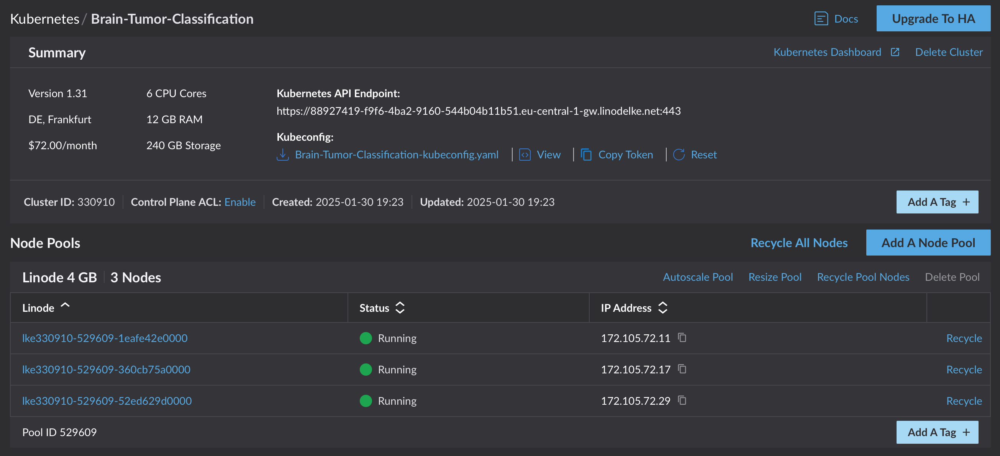
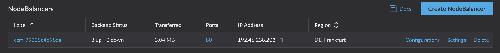
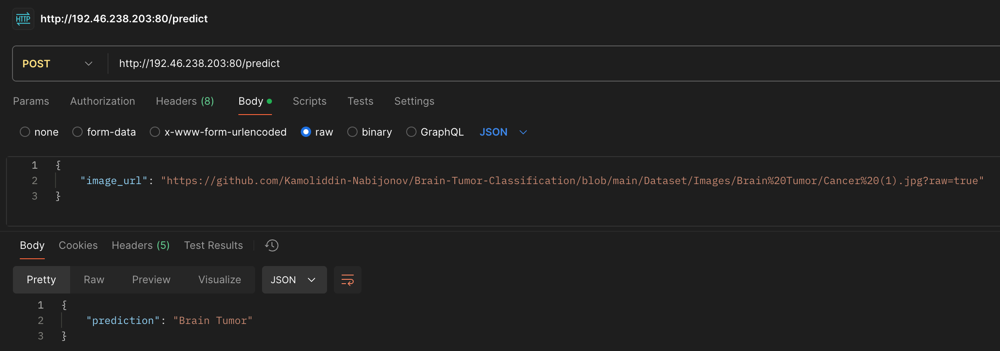
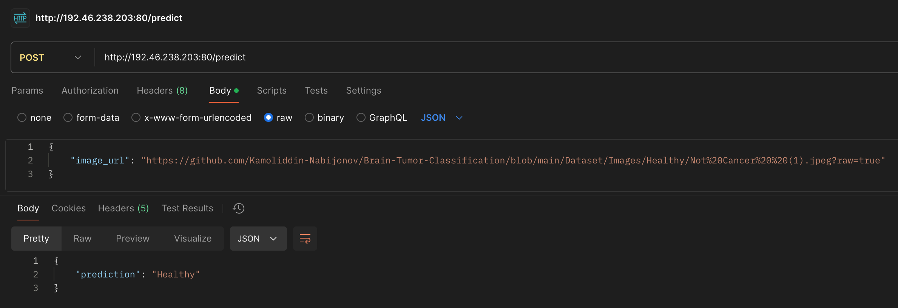

# Brain-Tumor-Classification



## Problem Description:

Brain cancer is a life-threatening condition that requires early and accurate diagnosis for effective treatment. Magnetic Resonance Imaging (MRI) is a widely used non-invasive technique for detecting brain tumors, but manual diagnosis by radiologists can be time-consuming and prone to human error. With the increasing availability of medical imaging data, deep learning techniques, particularly Convolutional Neural Networks (CNNs), have shown great promise in automating and improving diagnostic accuracy.

This project aims to develop a custom CNN model to classify brain MRI images as either cancerous or healthy. By leveraging deep learning, the model can assist radiologists in early detection, reducing diagnosis time and improving patient outcomes. The primary objective is to train and evaluate a CNN-based classification model using labeled MRI images and assess its performance based on accuracy, sensitivity, and specificity. If successful, this automated approach could enhance the reliability of brain cancer detection and potentially aid in real-world medical applications.


## Dataset Description:

**Dataset URL:** https://www.kaggle.com/datasets/preetviradiya/brian-tumor-dataset/data

**Dataset Overview:**

The Brain Tumor Dataset, curated by `Preet Viradiya` and hosted on Kaggle, consists of MRI images categorized into two distinct classes: `Brain Tumor` and `Healthy`. This dataset is designed for binary classification tasks and is particularly suitable for deep learning applications in medical imaging. The dataset comprises a total of 4,600 images distributed across both classes and includes two metadata files providing descriptive information about the images. The images are available in multiple formats, including `.png`, `.jpeg`, and `.tiff`, and exhibit variability in dimensions, necessitating preprocessing steps such as resizing prior to model training.

**Dataset Structure:**

The dataset is organized within a local directory named `Dataset`, which includes the following components:

`Images/` - Contains two subdirectories corresponding to the two classes: Brain Tumor and Healthy.  
`metadata.csv` - Provides metadata regarding the images.


## Model Training:

The file `model_training.ipynb` comprised of all steps that were performed during the training process including: `EDA`, `Dataset preporcessing`, `Training` and `Model Tuning`.

**Dataset Preprocessing:**

The dataset was loaded using the ImageDataGenerator module from TensorFlow and Keras. An analysis of class distribution was conducted to assess label imbalance, revealing a slight imbalance that was deemed non-critical for model performance. Images were then resized to a consistent dimension of `150×150` pixels and organized into batches of size `32`. The dataset was split into training and validation subsets, with `80%` of the images allocated to `training` and `20%` to `validation`. The identified class indices were as follows:

`Brain Tumor: 0`  
`Healthy: 1`

Representative images from both classes were visualized to better understand the dataset characteristics.

**Model Architecture and Training:**

A custom Sequential convolutional neural network (CNN) was implemented as the base model, with additional layers integrated to enhance classification performance. The architecture is depicted in the following diagram:

The final model contained a total of `11,243,457` parameters, of which `11,243,073` were trainable and `384` were non-trainable.

The initial model was compiled with default hyperparameters and trained for 20 epochs, incorporating an early stopping callback to prevent overfitting. The model achieved a `98% validation accuracy` by the 15th epoch, suggesting strong predictive performance. However, concerns regarding potential overfitting led to further optimization.

**Hyperparameter Tuning:**

To enhance model generalization, extensive hyperparameter tuning was performed, focusing on the following parameters:

`Learning rate: 0.0001`  
`Dropout rate: 0.2`  
`Dense layer size: 128`

Various data augmentation techniques were also explored; however, these resulted in a substantial decline in performance, with a maximum observed accuracy of `77%`.

**Comparison with Xception Model:**

For comparative analysis, the Xception architecture, pre-trained on ImageNet weights, was also implemented. This model achieved a `99% validation accuracy` but was ultimately not selected due to its significantly larger size and computational requirements to train this model.

**Final Model Selection and Training:**

The final CNN model was trained using the optimized hyperparameters (`learning rate = 0.0001, dropout rate = 0.2, dense layer size = 128`) with a ModelCheckpoint callback to save the best-performing models based on validation accuracy. The model was trained for 50 epochs, culminating in a final validation accuracy of `99%`.

The final model demonstrated exceptional performance, achieving near-perfect classification accuracy. Despite initial concerns regarding overfitting, rigorous fine-tuning of hyperparameters led to a robust and optimized model. Future improvements could explore alternative architectures or advanced augmentation strategies to further enhance generalization capabilities.

The script was implemented `model_training.py` to isolate the final training section. Execution of this file leads to model to be trained for 50 epochs on the dataset with resulting models being saved to `Trained_Models` directory.


## Model Testing and Validation:

A script named `model_testing.py` was implemented to validate the trained model against the entire dataset and assess its real-world classification performance. This script loads the best-performing model, iterates through the entire dataset of images, and evaluates the model's predictions by comparing them against the actual class labels. At the end of the process, the script generates a summary, which is illustrated in the image below::



As indicated on the screenshot above, the real accuracy of the model is around `97%`. 


## WEB Application:
The model is deployed as a Flask application. The file called `app.py` contains the core logic of web service. The app itself is served using gunicorn. 

This service provides an API endpoint (/predict) for classifying brain tumor images using a pre-trained model. It takes an image URL as input, processes the image (resizes it to 150x150, normalizes pixel values, and converts it into a model-compatible format), and then predicts whether the image belongs to the "Brain Tumor" or "Healthy" class. The classification result is returned as a JSON response. The app runs on port 9696 and includes error handling for invalid URLs and processing issues.


## Reproducibility:

It is possible to run all scripts locally by following below steps:

**To train the model:**
```
pipenv shell
pipenv install
python model_training.py
```

**To test the model:**  
**NOTE:** before running the script, please modify the script to load to the model you want to test. In my case it was `./Trained_Models/Sequential_13_0.999.keras`
```
pipenv shell
pipenv install
python model_testing.py 
```

**To run the application:**  
```
pipenv shell
pipenv install
gunicorn --bind 0.0.0.0:9696 app:app
```


## Containerization and Deployment:

Before deploying the service to Kubernetes, we have to prepare a docker image, build it, tag and push it to docker hub. This Dockerfile defines a lightweight container for deploying a Flask-based brain tumor classification API. It performs the following steps:

**Base Image:** Uses python:3.11-slim as the base image for a minimal Python environment.  
**Working Directory:** Sets /app as the working directory inside the container.  
**Dependencies:** Copies requirements.txt and installs necessary Python libraries without caching to keep the image lightweight.  
**Application Files:** Copies app.py (the main application script) and the Trained_Models directory (containing the pre-trained model).  
**Port Exposure:** Exposes port 9696 for the Flask application.  
**Environment Variable:** Sets FLASK_APP=app.py to specify the application entry point.  
**Startup Command:** Runs the application using gunicorn, binding it to 0.0.0.0:9696 to allow external access.

This setup ensures an optimized and production-ready deployment of the brain tumor classification API.

**Build and Run application as a docker container:**
```
docker build -t brain-tumor-classification .
docker run -p 9696:9696 brain-tumor-classification
```

## Testing:
To test the application, the `POST` request must be send to `http://127.0.0.1:9696/predict`

Here is the payload sample that can be used:

**Request:**
```
{
    "image_url": "https://github.com/Kamoliddin-Nabijonov/Brain-Tumor-Classification/blob/main/Dataset/Images/Brain%20Tumor/Cancer%20(1).jpg?raw=true"
}
```

**Response:**
```
{
    "prediction": "Brain Tumor"
}
```



As you can see, the service was able to correctly classify the image as `Brain Tumor`.


## Cloud Deployment:

For Cloud Deployment section I have decided to deploy my container to Kubernetes hosted on `https://cloud.linode.com/kubernetes`. Linode provides simplified approach to deployment and fully manages the cluster on their infrastructure.

Before deploying the container to linode, we have to tag the image and push it to docker hub so linode can later pick it up during pod creation:

**Tag and Push the image to Docker Hub:**
```
docker tag brain-tumor-classification kamoliddinnabijonov/brain-tumor-classification:backend
docker push kamoliddinnabijonov/brain-tumor-classification:backend
```

To control the cluster, you will need a `kubectl` on your local machine. The following command installs `kubectl` for Mac. For other hardware and OS please check corresponding intructions.

**Install kubectl and check:**
```
brew install kubectl
kubectl version --client
```


**Set Up the Kubernetes Cluster:**
To deploy your application, you need to set up a Kubernetes Cluster that will run your pods and services. There are lot of clusters provided by multiple cloud providers like Google, Amazon and Microsoft. For this application, we will use Linode. My cluster has 3 Nodes for 3 replicas I will create later during the deployment.



**Create the Pod, Deployment, and Service:**

Required configuration files are `deployment.yaml` and `service.yaml`.

```
kubectl apply -f deployment.yaml
kubectl apply -f service.yaml
kubectl get pods
```
```
NAME                                         READY   STATUS    RESTARTS   AGE
brain-tumor-classification-9d7669474-hwqbg   1/1     Running   0          17h
brain-tumor-classification-9d7669474-pkvd4   1/1     Running   0          17h
brain-tumor-classification-9d7669474-x5kwj   1/1     Running   0          17h
```

**Access the Application:**
The `service.yaml` creates `LoadBalancer` service on Linode and exposes an endpoint: `http://192.46.238.203:80/predict` to accept requests:




## Cloud Testing:


